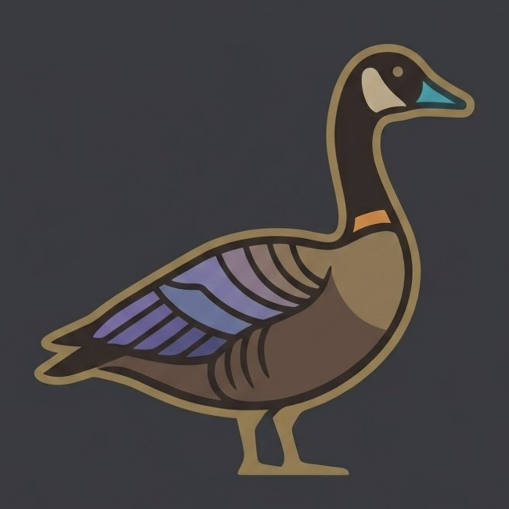

  
  <h3>Goose</h3>
  
Block distracting apps on iOS. Unlock with an NFC tag, a QR code, a timer, or a tap.

Goose uses Apple's Screen Time APIs to block the apps you choose. The strongest way to use it is with a physical key: an NFC tag or a printed QR code that you keep somewhere else. Unblocking means getting up and going to find it, so the friction is real. If you'd rather not, a profile can unlock on a timer or with a tap instead.

## Features

- **Quick setup:** first launch asks what to block and how to unlock, and that's it.
- **Unlock methods, per profile:**
  - **Tag or QR:** scan an NFC tag or a QR code you made in the app.
  - **Timer:** block for 15 minutes to 8 hours. No ending early.
  - **Button:** lock and unlock with a tap, as a gentle reminder.
- **Profiles:** different sets of blocked apps, categories and websites, each with its own unlock method.
- **Schedules:** lock a profile automatically, like every night or during work hours, and unlock it when the schedule ends. Works even when Goose is closed. You can still unlock early the profile's usual way.
- **Daily limits:** any amount of time per day across a profile's apps. When it runs out, Goose locks until midnight. Unlocking the profile's usual way turns the limit off for the rest of the day.
- **Stats:** the last 7 days, your streak and your longest block.
- **Tags and QR codes:** write NFC tags or print QR codes from the app. Any of them works on any profile, unless you give a profile a *dedicated* one. Then only that one can lock or unlock it.
- **Custom block screen:** blocked apps show "*App* is Goosed" with a short reminder instead of the default iOS screen.
- **Widget and Control:** Home Screen and Lock Screen widgets, and a Control Center control you can put on the Action Button. They show when you're locked, including by a schedule or daily limit, and open Goose to lock or unlock the profile's usual way, so they never skip a tag.
- **Quotes:** a rotating quote under the goose. Turn them off, or add your own.
- **Block history:** see how long past blocks lasted.
- **No ads, no tracking, and no affiliate links.** The "Get NFC Tags" link is a plain Google Shopping search.

See the [user guide](docs/guide.md) for how everything works. The same guide is in the app under the menu button (☰), along with schedules, daily limits, stats and quotes.

## Privacy

Goose has no accounts, analytics, ads or network code, so nothing leaves your phone. Your profiles, tags, schedules, daily limits, quotes and block history live on the device only. The camera is only used while you're scanning a QR code. Apple's Screen Time framework never shows Goose which apps you picked. It only gives Goose opaque tokens to block.

## Building

You need a Mac with Xcode 26+, an iPhone on iOS 26+, and an Apple Developer account. Screen Time blocking, NFC and QR scanning don't work in the Simulator.

1. Clone the repo.
2. Copy `Config/Local.xcconfig.example` to `Config/Local.xcconfig` and set your Team ID and a bundle ID you own. This file is git-ignored. The extensions and the App Group are derived from these values.
3. Open `Goose.xcodeproj`, select your iPhone, and run.

If you publish your own build, replace the developer details and tip link in `Goose/AboutContent.swift`.

There's also a Nix flake with helper commands: `nix run .#build-device`, `nix run .#build-sim`, `nix run .#run-sim`, `nix run .#test` and `nix run .#watch`.

Screen Time capabilities (`com.apple.developer.family-controls`) work for development builds. Distributing through the App Store needs Apple's approval.

## Tags and QR codes

**QR codes:** tap **+** → **Make a QR Code**, then print it or keep it on another device. A phone can't scan a code on its own screen, so keep it somewhere else. You can view or reprint it any time from **+** → **Manage Tags and QR Codes**.

**NFC tags:** any rewritable NFC tag that an iPhone can read works: NTAG213/215/216 (the cheapest and most common), MIFARE Ultralight, DESFire, ICODE SLIX or FeliCa Lite-S. Stickers, cards and key fobs are all fine. [Search for NTAG213 stickers](https://www.google.com/search?tbm=shop&q=NTAG213+NFC+stickers) (a plain search, not an affiliate link). Tap **+** in the app to write one. Each tag gets a random code that Goose remembers.

**Avoid MIFARE Classic.** Many cheap "13.56 MHz" key fobs and cards use it, and iPhones can't read it. Check that a listing says NTAG before you buy.

## Limits

Goose is a commitment device, not a lock you can't get around:

- Tags store their code as plain text, so anyone with an NFC app can read and copy one.
- Deleting Goose, or turning off its Screen Time permission in Settings, removes all blocks.
- While blocked, you can still create a new tag for the current profile. That's a recovery path in case you lose your tag.

## Project layout

| Folder | What it is |
| --- | --- |
| `Goose/` | The app |
| `GooseShield/` | Shield Configuration extension (the custom block screen) |
| `GooseWidget/` | Widgets and the Control Center / Action Button control |
| `GooseMonitor/` | Device Activity Monitor extension that runs timers, schedules and daily limits when Goose isn't running |
| `GooseTests/` | Unit tests for the tag rules, schedules, stats, saved-data compatibility and timer scheduling |
| `Shared/` | Code shared by the app and its extensions (state stored in the App Group) |
| `Config/` | Signing and bundle ID settings |

## Contributing

Contributions are welcome. See [CONTRIBUTING.md](CONTRIBUTING.md). Run the tests with `nix run .#test` or ⌘U in Xcode.

## License

Goose is licensed under the [Apache License 2.0](LICENSE), including its artwork.

Goose isn't affiliated with Apple.
